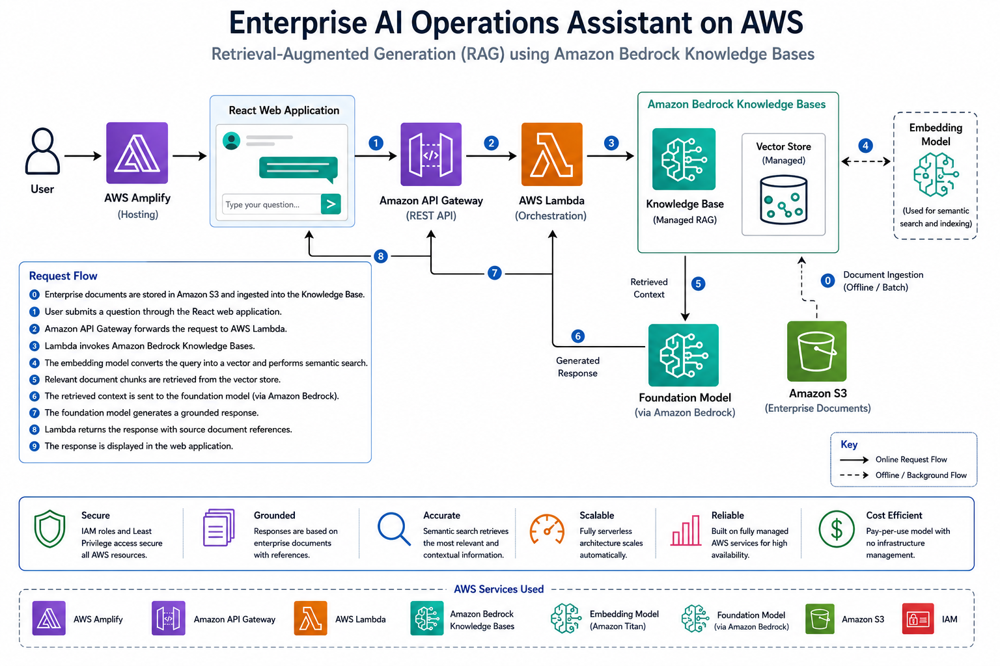
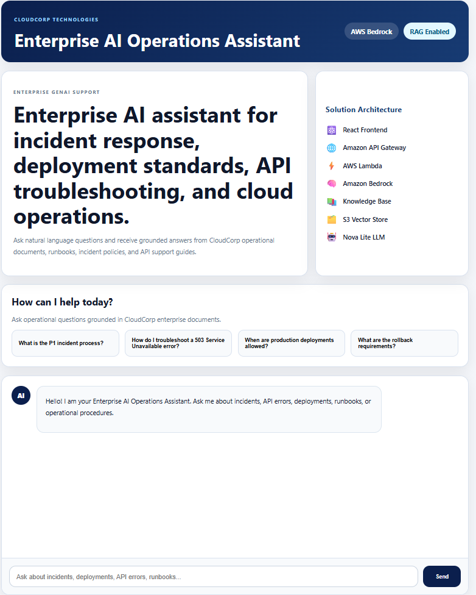
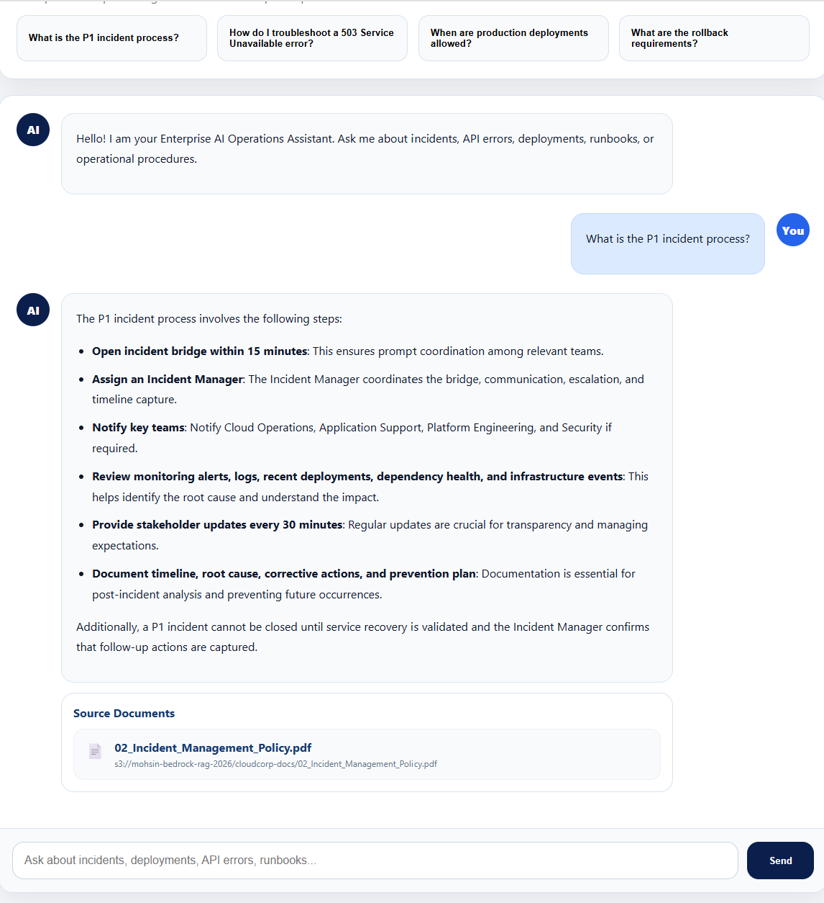
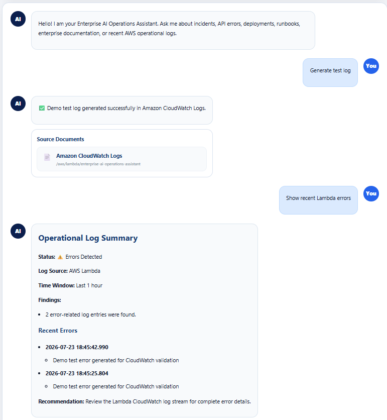

# Enterprise AI Operations Assistant on AWS

AI-powered operational support using Retrieval-Augmented Generation (RAG), Amazon Bedrock, and Amazon CloudWatch to provide intelligent access to enterprise knowledge and operational logs.

---

# Overview

Enterprise support teams often spend significant time searching across runbooks, incident records, operational documentation, and knowledge repositories before identifying the root cause of an issue.

The Enterprise AI Operations Assistant demonstrates how Generative AI and Retrieval-Augmented Generation (RAG) can be used to provide grounded, explainable answers using trusted enterprise knowledge.

Built entirely on managed AWS services, the solution showcases how enterprise knowledge can be transformed into an intelligent operational assistant without training or fine-tuning a custom Large Language Model.

---

# Live Demo

A live proof of concept is hosted on AWS Amplify.

**Application**

https://main.d2zuwqwp922u1r.amplifyapp.com

---

# AWS Implementation

| Service | Purpose |
|----------|---------|
| AWS Amplify | Hosts the React web application |
| Amazon API Gateway | Exposes REST API endpoints |
| AWS Lambda | Backend orchestration and request routing |
| Amazon Bedrock Knowledge Bases | Managed Retrieval-Augmented Generation (RAG) |
| Amazon Titan Embeddings | Semantic document search |
| Amazon Nova Lite | Generates grounded AI responses |
| Amazon S3 | Stores enterprise documentation |
| IAM | Identity and access management |
| Amazon CloudWatch Logs | Stores application and Lambda operational logs |
| Amazon CloudWatch Logs Insights | Queries and filters recent operational errors |

The assistant supports enterprise knowledge queries using Amazon Bedrock Knowledge Bases and operational log queries using Amazon CloudWatch Logs Insights, providing a single conversational interface for both enterprise knowledge and recent operational information.

---

# Business Challenge

Production support engineers often investigate issues by searching across multiple disconnected systems, including:

- Application Logs
- Monitoring Platforms
- Runbooks
- Incident Records
- Knowledge Articles
- Internal Documentation

This fragmented approach increases Mean Time to Resolution (MTTR), creates heavy dependency on Subject Matter Experts (SMEs), and results in inconsistent troubleshooting processes.

The Enterprise AI Operations Assistant addresses this challenge by providing a single conversational interface that retrieves trusted enterprise knowledge and generates grounded, explainable responses using Retrieval-Augmented Generation (RAG).

The following diagram illustrates the enterprise knowledge fragmentation problem.

---

# Solution

The Enterprise AI Operations Assistant provides a centralized conversational interface that enables users to access both enterprise knowledge and operational logs using natural language.

## Enterprise Knowledge Assistant

Users can ask operational questions such as:

> What is the P1 incident process?

Amazon Bedrock Knowledge Bases retrieves relevant enterprise documentation using semantic search powered by Amazon Titan Embeddings. Amazon Nova Lite then generates a grounded response using the retrieved enterprise context.

Responses may include:

- Probable Root Cause
- Supporting Evidence
- Recommended Actions
- References to Retrieved Source Documents

## Operational Log Monitoring

Users can also query recent operational errors directly through the same conversational interface.

Example:

> Show recent Lambda errors

AWS Lambda identifies the request as a log-related query and uses Amazon CloudWatch Logs Insights to retrieve recent error-related entries. The results are formatted and presented as an operational log summary.

This enables users to access both enterprise knowledge and recent operational information through a single interface.

---

# Solution Architecture

The solution was first designed as a conceptual Retrieval-Augmented Generation (RAG) workflow and then implemented using fully managed AWS services.

## Conceptual RAG Architecture

The following diagram illustrates the conceptual RAG workflow.

## AWS Implementation Architecture

The following diagram shows how the solution is implemented using AWS managed services.

---

# Application

## Home Page

## Sample AI Response

The assistant retrieves relevant enterprise documents and generates grounded responses with references to the retrieved source documents.

## Operational Log Monitoring

Users can request recent AWS Lambda errors directly through the conversational interface.

Example:

> Show recent Lambda errors

The application queries Amazon CloudWatch Logs Insights and presents matching error-related entries as an operational log summary.

---

# Enterprise Value

This project demonstrates how Retrieval-Augmented Generation (RAG) and managed AWS AI services can be applied to enterprise operational support.

Key business outcomes include:

- Reduced Mean Time to Resolution (MTTR)
- Reduced dependency on Subject Matter Experts (SMEs)
- Faster knowledge discovery
- Improved operational efficiency
- Consistent troubleshooting guidance
- Scalable enterprise knowledge management

---

# Technologies

## AWS Services

- AWS Amplify
- Amazon API Gateway
- AWS Lambda
- Amazon Bedrock
- Amazon Bedrock Knowledge Bases
- Amazon Titan Embeddings
- Amazon Nova Lite
- Amazon S3
- IAM
- Amazon CloudWatch Logs/Insights

## AI & Architecture

- Retrieval-Augmented Generation (RAG)
- Semantic Search
- Large Language Models (LLMs)
- Embedding Models
- Serverless Architecture
- Enterprise AI Solution Design
- Knowledge Management

---

## Future Enhancements

- AI-powered summarization and root cause analysis of operational logs
- Support for multiple CloudWatch log groups
- API Gateway, application, and audit log analysis
- Correlation between operational logs and enterprise knowledge
- Conversation memory and chat history
- Automated remediation recommendations

---

# License

This project is provided for educational and portfolio purposes.
