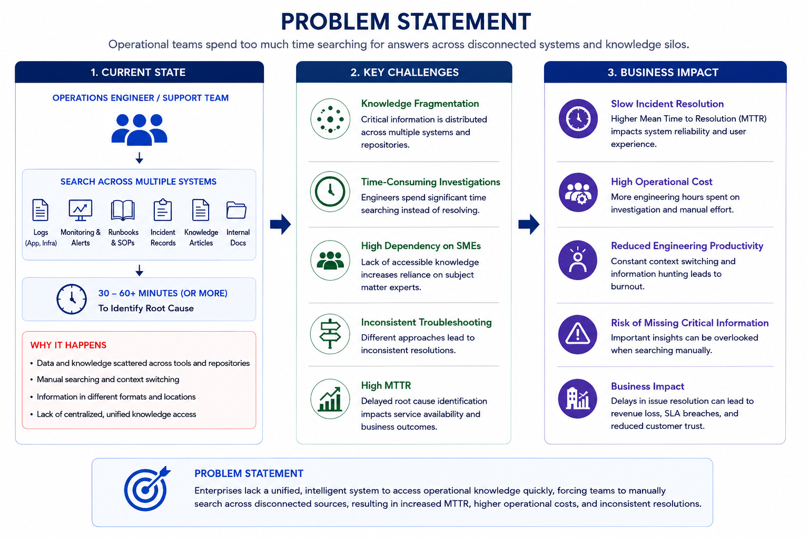
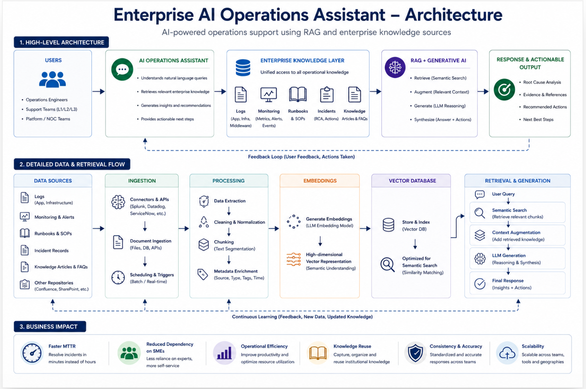

# Enterprise AI Operations Assistant on AWS

AI-powered operational support using Retrieval-Augmented Generation (RAG) and Amazon Bedrock to transform enterprise documentation into an intelligent knowledge assistant.

---

# Overview

Enterprise support teams often spend significant time searching across runbooks, incident records, operational documentation, and knowledge repositories before identifying the root cause of an issue.

The Enterprise AI Operations Assistant demonstrates how Generative AI and Retrieval-Augmented Generation (RAG) can be used to provide grounded, explainable answers using trusted enterprise knowledge.

The solution showcases how managed AWS AI services can be combined to build a cloud-native enterprise knowledge assistant without training or fine-tuning a custom Large Language Model.

---

# Live Demo

A working proof of concept is available below.

**Application**

https://main.d2zuwqwp922u1r.amplifyapp.com

---

# AWS Implementation

| Service | Purpose |
|----------|---------|
| AWS Amplify | Hosts the React web application |
| Amazon API Gateway | Exposes REST API endpoints |
| AWS Lambda | Serverless backend orchestration |
| Amazon Bedrock Knowledge Bases | Managed Retrieval-Augmented Generation (RAG) |
| Amazon Titan Embeddings | Semantic document search |
| Amazon Nova Lite | Generates grounded AI responses |
| Amazon S3 | Stores enterprise documentation |
| IAM | Identity and access management |

Users can ask operational questions in natural language and receive AI-generated responses grounded in enterprise documentation, including references to the source documents used during retrieval.

---

# Business Challenge

Production support engineers often investigate issues across multiple disconnected systems before identifying the root cause.

Typical information sources include:

- Application Logs
- Monitoring Platforms
- Runbooks
- Incident Records
- Knowledge Articles
- Internal Documentation

This fragmented approach results in:

- Increased Mean Time to Resolution (MTTR)
- Heavy dependency on Subject Matter Experts (SMEs)
- Manual knowledge discovery
- Inconsistent troubleshooting approaches
- Reduced operational efficiency

---

# Problem Statement

Operational knowledge is often fragmented across multiple enterprise systems, making troubleshooting slow and dependent on individual expertise.

The following diagram illustrates this challenge.



---

# Solution

The Enterprise AI Operations Assistant provides a centralized conversational interface that allows users to ask operational questions using natural language.

Example:

> Why is the application responding slowly today?

Amazon Bedrock Knowledge Bases retrieves the most relevant enterprise documentation using semantic search powered by Amazon Titan Embeddings.

Amazon Nova Lite then generates a grounded response based on the retrieved enterprise context rather than relying solely on its pre-trained knowledge.

Responses include:

- Probable Root Cause
- Supporting Evidence
- Recommended Actions
- References to Source Documents

---

# Solution Architecture

The application is implemented using a fully managed serverless architecture on AWS.



## Request Flow

1. User submits a question through the React application hosted on AWS Amplify.
2. Amazon API Gateway receives the request.
3. API Gateway invokes AWS Lambda.
4. Lambda calls Amazon Bedrock Knowledge Bases.
5. Bedrock performs semantic retrieval using Amazon Titan Embeddings.
6. Relevant document chunks are retrieved from the managed vector store.
7. Amazon Nova Lite generates a grounded response.
8. Lambda returns the response together with references to the source documents.
9. The React application displays the final response.

---

# Why This Architecture?

### Amazon Bedrock Knowledge Bases

Provides a fully managed Retrieval-Augmented Generation (RAG) capability without requiring a custom vector database or retrieval pipeline.

### Retrieval-Augmented Generation (RAG)

Enterprise documentation changes frequently. RAG enables new knowledge to be incorporated without retraining the foundation model.

### Serverless Architecture

AWS Lambda and Amazon API Gateway minimize operational overhead while providing automatic scalability.

### Source Document References

Displaying the retrieved source documents increases transparency and allows users to verify the origin of AI-generated responses.

---

# How RAG Works

The solution follows a standard Retrieval-Augmented Generation workflow.

```
Enterprise Documents
        ↓
Document Processing
        ↓
Chunking & Metadata
        ↓
Titan Embeddings
        ↓
Bedrock Knowledge Base
        ↓
Semantic Retrieval
        ↓
Nova Lite
        ↓
Grounded AI Response
```

The retrieved enterprise context is combined with the user's question before being sent to the foundation model, ensuring responses remain grounded in trusted organizational knowledge.

---

# Enterprise Value

This solution demonstrates how enterprise knowledge can be transformed into an AI-powered operational assistant using fully managed AWS services.

Business benefits include:

- Reduced Mean Time to Resolution (MTTR)
- Reduced dependency on Subject Matter Experts
- Faster knowledge discovery
- Improved operational efficiency
- Consistent troubleshooting guidance
- Scalable enterprise knowledge management

---

# Future Enhancements

Possible future enhancements include:

- Conversation memory
- Amazon Cognito authentication
- Chat history
- Real-time document synchronization
- Multiple Knowledge Bases
- Streaming responses
- Feedback collection
- CloudWatch monitoring
- Cost analytics
- Amazon Bedrock Agents

---

# Skills Demonstrated

- AWS Solution Architecture
- Amazon Bedrock
- Amazon Bedrock Knowledge Bases
- Amazon Titan Embeddings
- Retrieval-Augmented Generation (RAG)
- Semantic Search
- Large Language Models (LLMs)
- Serverless Architecture
- API Design
- Enterprise AI Solution Design
- Knowledge Management

---

# License

This project is provided for educational and portfolio purposes.
